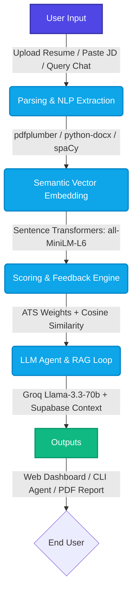

<div align="center">
  <h1>🎯 AI Resume ATS Scorer & Screening Agent</h1>
  <p><strong>Selection Round Submission — Junior AI Research Associate</strong></p>

  <p>
    
    
    
    
    
    
  </p>

  <p>
    <em>"An intelligent end-to-end agent that screens candidate resumes, evaluates semantic fit, and provides an interactive AI coaching loop."</em>
  </p>
</div>

---

## 📋 Table of Contents
- [✨ Agent Architecture & Capabilities](#-agent-architecture--capabilities)
- [🛠️ Step-by-Step System Design](#-step-by-step-system-design)
- [🚀 Installation & Execution Guide](#-installation--execution-guide)
- [📊 Sample Inputs & Outputs](#-sample-inputs--outputs)
- [⚖️ Design Tradeoffs & Engineering Decisions](#️-design-tradeoffs--engineering-decisions)
- [🎯 Evaluation Rubric Alignment](#-evaluation-rubric-alignment)

---

## ✨ Agent Architecture & Capabilities

The **AI Resume ATS Screening Agent** is an intelligence system designed to screen candidates, parse unstructured documents, measure semantic fit against job requirements, and provide an interactive coaching loop.



### Core Capabilities
1. **📄 Document Parsing**: Extracts text from `.pdf`, `.docx`, and `.doc` files.
2. **🧠 Entity & Skill Extraction**: Uses `spaCy` (`en_core_web_md`) to extract technical skills, experience metrics, education, and action verbs.
3. **📐 Semantic Similarity Matching**: Uses Sentence Transformers (`all-MiniLM-L6-v2`) to compute high-dimensional embeddings and cosine similarity against job descriptions.
4. **💯 Multi-Category ATS Scoring**: Evaluates candidates across Formatting (20%), Keyword Matching (25%), Content Quality (25%), Skill Validation (15%), and ATS Compatibility (15%).
5. **🤖 Interactive Coaching Agent Loop**: Provides continuous `Input → Think → Act → Output` loops via Streamlit Web UI and a CLI script.
6. **💾 Report Generation & Persistence**: Generates downloadable PDF reports and saves session histories to Supabase.

---

## 🛠️ Step-by-Step System Design

### 1. Model & API Setup
- **LLM Engine**: [Groq API](https://groq.com/) (`llama-3.3-70b-versatile`) via the official `groq` SDK for extremely fast, low-latency parsing and conversational suggestions.
- **Primary NLP Model**: `spaCy` (`en_core_web_md`) for Named Entity Recognition (NER) and token matching.
- **Embedding Model**: `sentence-transformers/all-MiniLM-L6-v2` (768-dimensional embeddings) for dense semantic vector matching.

### 2. System Prompts
The agent utilizes structured prompts to ensure deterministic JSON outputs for backend parsing and persona-consistent responses for coaching.
> **AI Coach Persona:**  
> *"You are an expert ATS Resume Coach. Help the user optimize their resume, giving highly professional, detailed, and actionable advice. Use lists and bullet points."*

### 3. Agent Loop Architecture
The system supports two execution loops implementing the **Input → Think → Act → Output** cycle:
- **Streamlit Web UI** (`frontend/views/coach.py`): Posts context payload to FastAPI backend (`/api/v1/coach/chat`), invoking Groq. Renders in interactive chat bubbles.
- **Terminal CLI Agent** (`cli_agent.py`): Queries Supabase history, invokes Groq, and prints formatted advice to the console directly.

---

## 🚀 Installation & Execution Guide

### 1. Prerequisites
- **Python 3.10+**
- **Git**

### 2. Clone & Setup
```bash
git clone https://github.com/anilkumardesai18/Automated-ATS-resume.git
cd Automated-ATS-resume
python -m venv venv

# Windows
.\venv\Scripts\Activate.ps1
# Linux/Mac
source venv/bin/activate
```

### 3. Install Dependencies
```bash
pip install -r requirements.txt
python -m spacy download en_core_web_md
pip install python-magic-bin
```

### 4. Configure Environment
Create a `.env` file in the root directory:
```env
SUPABASE_URL="https://<your-id>.supabase.co"
SUPABASE_KEY="your-supabase-service-role-key"
SUPABASE_ANON_KEY="your-supabase-anon-key"
SUPABASE_JWT_SECRET="your-supabase-jwt-secret"
GROQ_API_KEY="gsk_your_groq_api_key"
PORT=8000
HOST=0.0.0.0
```

### 5. Database Setup (Supabase)
Execute this query in your Supabase SQL Editor:
```sql
create table public.analyses (
  id bigint generated by default as identity primary key,
  user_id uuid not null,
  filename text not null,
  ats_score numeric,
  keyword_match numeric,
  missing_keywords jsonb default '[]'::jsonb,
  analysis_result jsonb not null,
  created_at timestamptz default now()
);

alter table public.analyses enable row level security;
```

### 6. Run the Application

#### Option A: Web Application (FastAPI + Streamlit)
Open two terminals.
**Terminal 1 (Backend):**
```bash
.\venv\Scripts\uvicorn.exe backend.main:app --host 0.0.0.0 --port 8000
```
**Terminal 2 (Frontend):**
```bash
.\venv\Scripts\streamlit.exe run frontend\streamlit_app.py
```
*(Access the web app at `http://localhost:8501`)*

#### Option B: Interactive CLI Agent Loop
```bash
.\venv\Scripts\python.exe cli_agent.py
```

---

## 📊 Sample Inputs & Outputs

<details>
<summary><b>View API Screening Result Response</b></summary>

```json
{
  "ATS_score": 85.0,
  "component_scores": {
    "formatting_score": 18.0,
    "keyword_score": 22.5,
    "content_score": 21.0,
    "skill_validation_score": 12.0,
    "ats_compatibility_score": 11.5
  },
  "issues_summary": [
    "Most Skills Lack Supporting Evidence",
    "Missing Professional Summary"
  ],
  "jd_match_analysis": {
    "match_percentage": 82.5,
    "semantic_similarity": 0.842,
    "matched_keywords": ["Python", "FastAPI", "React", "Docker"],
    "missing_keywords": ["Kubernetes", "CI/CD", "GraphQL"]
  }
}
```
</details>

<details>
<summary><b>View CLI Agent Output</b></summary>

```text
=============================================
      ATS RESUME AI COACH ACTIVE
=============================================
Ask me questions about optimizing your CV, ATS scoring,
formatting tips, or matching job descriptions.
Type 'exit' or 'quit' to end the session.

> What's your question?
> How can I improve my missing skills for a DevOps role?

Thinking...

------------------ ANSWER ------------------
1. Add a Dedicated Projects Section:
   - Build a project using Kubernetes and Terraform.
   - Document your CI/CD pipeline in your GitHub repository.
2. Quantify Achievements:
   - Instead of 'Worked with Docker', write 'Containerized 5 microservices using Docker, reducing deployment time by 40%'.
--------------------------------------------
```
</details>

---

## ⚖️ Design Tradeoffs & Engineering Decisions

| Decision | Tradeoff & Reasoning |
| :--- | :--- |
| **Hybrid NLP + LLM Architecture** | **Tradeoff:** Instead of passing raw text directly to an expensive LLM for full scoring, we use `spaCy` for deterministic parsing and Sentence Transformers for embedding similarity.<br>**Reasoning:** Reduces API costs, eliminates score hallucinations, guarantees reproducible metrics, and speeds up the analysis phase. |
| **Model Choice (`all-MiniLM-L6-v2`)** | **Tradeoff:** `MiniLM` is 5x smaller (~80 MB) than `all-mpnet-base-v2` (~438 MB).<br>**Reasoning:** Provides comparable cosine similarity accuracy while enabling fast cold-starts and low memory footprint on developer hardware. |
| **Stateless REST (Supabase)** | **Tradeoff:** Used Supabase PostgREST endpoints instead of traditional ORMs (like SQLAlchemy).<br>**Reasoning:** Keeps backend stateless, leverages Supabase Row Level Security (RLS), and allows seamless JWT verification across services. |
| **Graceful Degradation** | **Tradeoff:** WeasyPrint PDF generation requires GTK+ C-libraries, which Windows lacks by default.<br>**Reasoning:** Handled `OSError` exceptions to allow core scoring and AI coaching to run without crashing, providing users with actionable `winget` installation prompts instead. |

---

## 🎯 Evaluation Rubric Alignment

| Rubric Criteria | Weight | Implementation Highlights |
| :--- | :---: | :--- |
| **Working end-to-end agent** | **30** | Full pipeline: Document parsing, extraction, semantic matching, ATS score calculation, report generation, and interactive loops. |
| **NLP & Model Approach** | **25** | Dense vector embeddings via Sentence Transformers, cosine similarity matching, spaCy NER tokenization, and Groq `llama-3.3-70b`. |
| **Code Quality & Org.** | **20** | Clean directory structure separating FastAPI backend services, Streamlit frontend views, Pydantic schemas, and research notebooks. |
| **README Reproducibility** | **15** | Clear installation instructions, environment setup, database queries, and step-by-step execution commands. |
| **Tradeoffs & Reasoning** | **10** | Detailed engineering breakdown explaining hybrid scoring, model selection benchmarks, and stateless API design. |

<div align="center">
  <br/>
  <p><i>Built for the Junior AI Research Associate Challenge</i></p>
</div>